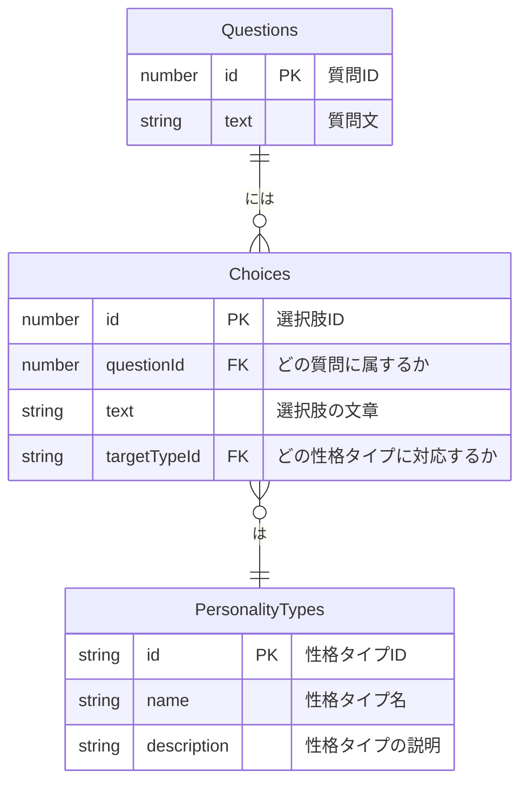

# データ定義書 - 性格診断アプリ

このドキュメントは、性格診断アプリで使用されるデータの構造を定義したものです。
このアプリはサーバーを持たないため、ここでの「テーブル」は、プログラム内で使用されるデータの設計図とお考えください。

## データ関係図 (ER図)

データ同士の関連性を図で示します。

### 図の読み方

- `Questions`（質問）には、複数の`Choices`（選択肢）があります。
- `Choices`（選択肢）は、どれか一つの`PersonalityTypes`（性格タイプ）に対応しています。

---

## テーブル定義

### 1. `PersonalityTypes` (性格タイプ)

診断結果として表示される、5種類の性格タイプの情報を管理します。

| カラム名 | 説明 | 例 |
| :--- | :--- | :--- |
| `id` (ID) | 性格タイプを識別するための一意のIDです。 | `adventurer` |
| `name` (性格タイプ名) | 「〇〇型」のようなキャッチーな名前です。 | `情熱の冒険家型` |
| `description` (説明) | 性格タイプの特徴や傾向を説明する文章です。| `好奇心旺盛で、常に新しい挑戦を求めるタイプです...` |

### 2. `Questions` (質問)

ユーザーに出題される質問のリストです。

| カラム名 | 説明 | 例 |
| :--- | :--- | :--- |
| `id` (ID) | 質問を識別するための一意のIDです。 | `1` |
| `text` (質問文) | ユーザーに表示される質問の文章です。 | `休日の過ごし方で、より好ましいのは？` |

### 3. `Choices` (選択肢)

各質問に対してユーザーが選ぶことができる、回答の選択肢です。

| カラム名 | 説明 | 例 |
| :--- | :--- | :--- |
| `id` (ID) | 選択肢を識別するための一意のIDです。 | `101` |
| `questionId` (質問ID) | この選択肢がどの質問に属しているかを示します。 | `1` |
| `text` (選択肢の文章) | ユーザーに表示される選択肢の文章です。 | `友人と集まって賑やかに過ごす` |
| `targetTypeId` (対応する性格タイプID) | この選択肢を選ぶと、どの性格タイプにポイントが加算されるかを示します。 | `adventurer` |

## 診断ロジックの補足

ユーザーが診断を進める中で、選択した回答（`Choices`）に対応する性格タイプ（`targetTypeId`）を集計します。
全ての質問に回答し終わった時点で、最も多く選択された性格タイプを診断結果として表示します。
