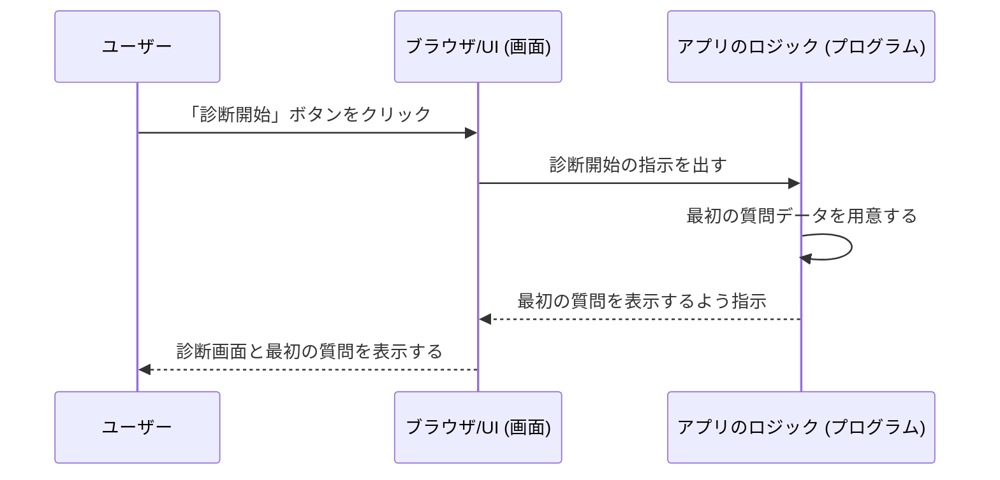
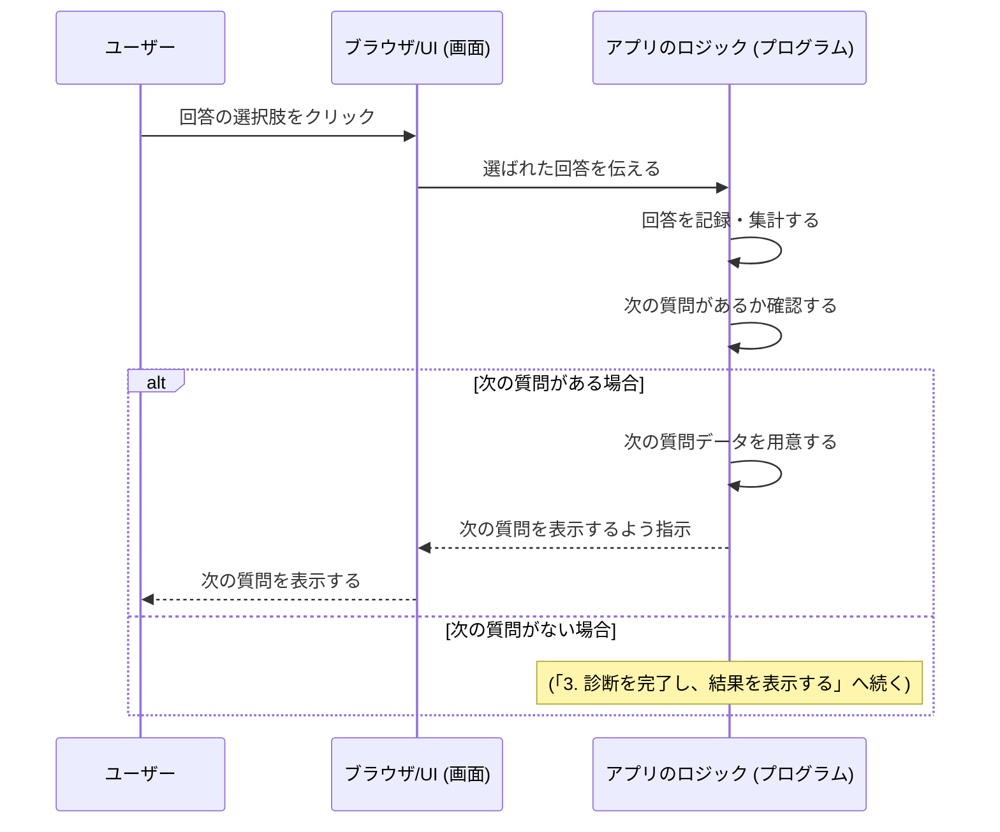
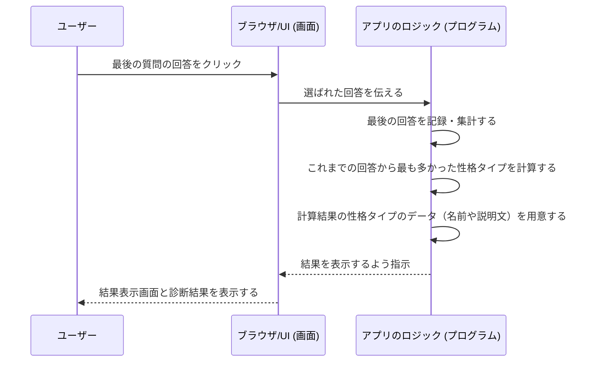
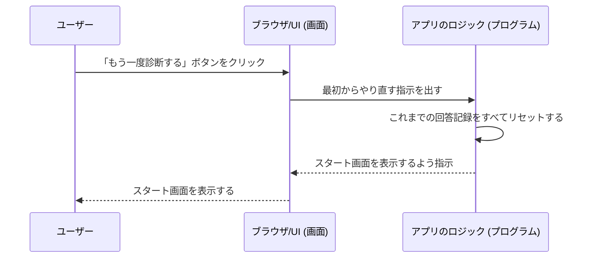

# シーケンス図 - 性格診断アプリ

このドキュメントは、性格診断アプリの主な機能が、どのような順序で処理されるかを時系列で示した図（シーケンス図）をまとめたものです。

### シーケンス図とは？

登場人物（このアプリでは「ユーザー」「画面」「プログラム」）の間で、どのようなメッセージや指示が、どの順番で行われるかを示した図です。「誰が」「いつ」「何をするか」を分かりやすく表現します。

---

### 1. 診断を開始する

ユーザーがスタート画面で「診断開始」ボタンを押してから、最初の質問が表示されるまでの流れです。

**解説:**
ユーザーがボタンを押すと、画面はその操作をプログラムに伝えます。プログラムは表示すべき最初の質問を準備し、それを画面に渡して表示させます。

---

### 2. 質問に回答し、次の質問へ進む

ユーザーが一つの質問に答えてから、次の質問が表示されるまでの流れです。

**解説:**
ユーザーが回答を選ぶと、プログラムはその選択を記録します。そして、まだ答えていない質問があれば、次の質問を画面に表示します。この流れを最後の質問まで繰り返します。

---

### 3. 診断を完了し、結果を表示する

最後の質問に答えてから、診断結果が表示されるまでの流れです。

**解説:**
最後の質問に答えると、プログラムはこれまでの回答を集計し、どの性格タイプに最も当てはまるかを計算します。そして、その結果（性格タイプの名前や詳しい説明）を画面に表示します。

---

### 4. もう一度診断する

結果画面で「もう一度診断する」ボタンを押してから、スタート画面に戻るまでの流れです。

**解説:**
ユーザーが「もう一度」ボタンを押すと、プログラムは今までの回答データをすべて消去して、アプリを一番最初の状態に戻します。これにより、まっさらな状態から再び診断を始めることができます。